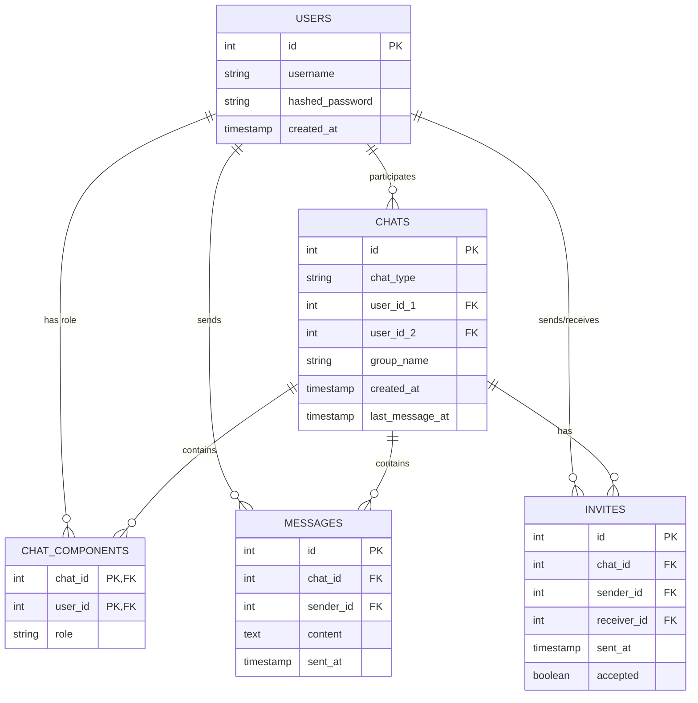

# Ruggine — Text Chat Application

Ruggine is a web-based text chat application developed for the **System Programming** course at Politecnico di Torino.

The application supports private and group conversations, real-time messaging, an invitation system, group member management, and server performance monitoring.

The project follows a client-server architecture, with a **Rust backend** and a **React + TypeScript frontend**.

## Features

* User registration and authentication
* Private conversations
* Group conversations
* Real-time message sending and receiving
* Group invitation system
* Group member management
* Chat search
* Username autocomplete when creating chats
* Server performance monitoring
* Stress testing with k6

## Architecture

The project is organized into the following components:

```text
Ruggine/
├── frontend/           # React + TypeScript web client
├── backend/            # Rust server
├── docker/
│   └── postgres/       # PostgreSQL database setup
├── stress-test/        # k6 stress tests
└── swagger.yaml        # REST API specification
```

The frontend communicates with the backend through a **REST API** for standard operations and **WebSockets** for real-time events.

The backend is structured around separate components for:

* **API** — HTTP endpoints and request handling
* **Business logic and models** — application data and logic
* **Repository** — database access
* **Authentication** — password handling and JWT-based authentication
* **WebSockets** — real-time communication

PostgreSQL is used as the persistent database, while Docker Compose is used to simplify the database setup.

## My Contribution

I worked primarily on the **frontend together with Vito Piazzolla**, contributing to the design and implementation of the React/TypeScript client and its interaction with the backend.

My work included:

* Developing and organizing the main chat interface
* Working on chat and group management interactions
* Integrating the frontend with the REST API
* Working on real-time communication through WebSockets
* Implementing chat search and username autocomplete
* Handling authentication state and client-side navigation
* Working on message, invitation, and group-member management interfaces

The frontend was developed collaboratively, while **Francesco Papini and Giacomo Scorza primarily worked on the Rust backend**.

## Technologies

### Backend

* **Rust**
* **Actix Web** — HTTP server and WebSocket handling
* **Diesel** — ORM for PostgreSQL
* **Tokio** — asynchronous runtime
* **Serde** — serialization and deserialization
* **sysinfo** — CPU and RAM monitoring
* **PostgreSQL**

### Frontend

* **React**
* **TypeScript**
* **Vite**
* **React Router**
* **React Bootstrap**
* **react-hot-toast**

### Testing

* **k6** — load and stress testing

### Infrastructure

* **Docker / Docker Compose**
* **PostgreSQL**

## Getting Started

### Requirements

* Node.js ≥ 18
* npm ≥ 9
* Rust ≥ 1.63
* Docker
* k6 ≥ 1.6 (only required for stress testing)

### 1. Install frontend dependencies

From the `frontend/` directory:

```bash
npm install
```

### 2. Start the database

From the `docker/postgres/` directory:

```bash
docker compose up -d
```

This starts the PostgreSQL database used by the backend.

### 3. Start the backend

From the `backend/` directory:

```bash
cargo run
```

The backend runs on:

```text
http://localhost:3000
```

### 4. Start the frontend

From the `frontend/` directory:

```bash
npm run dev
```

The web application is available at:

```text
http://localhost:5173
```

## Stress Testing

The `stress-test/` directory contains the k6 scripts used to evaluate the server under concurrent requests.

Run the stress test with:

```bash
k6 run stress.js
```

or:

```bash
npm run stress
```

The stress test simulates multiple concurrent requests against the server for approximately two minutes.

Server CPU and RAM usage can be monitored through:

```text
backend/src/monitor_cpu.rs
```

The collected information is written to:

```text
backend/monitor_cpu.log
```

## Database

The application uses PostgreSQL to persist:

* Users
* Chats
* Chat members and roles
* Messages
* Invitations

The database schema is represented by the following relationships:



## Team

Developed as a team project for the **System Programming** course at Politecnico di Torino.

* **Francesco Magno** — frontend development, together with Vito Piazzolla
* **Vito Piazzolla** — frontend development, together with Francesco Magno
* **Francesco Papini** — backend development
* **Giacomo Scorza** — backend development
